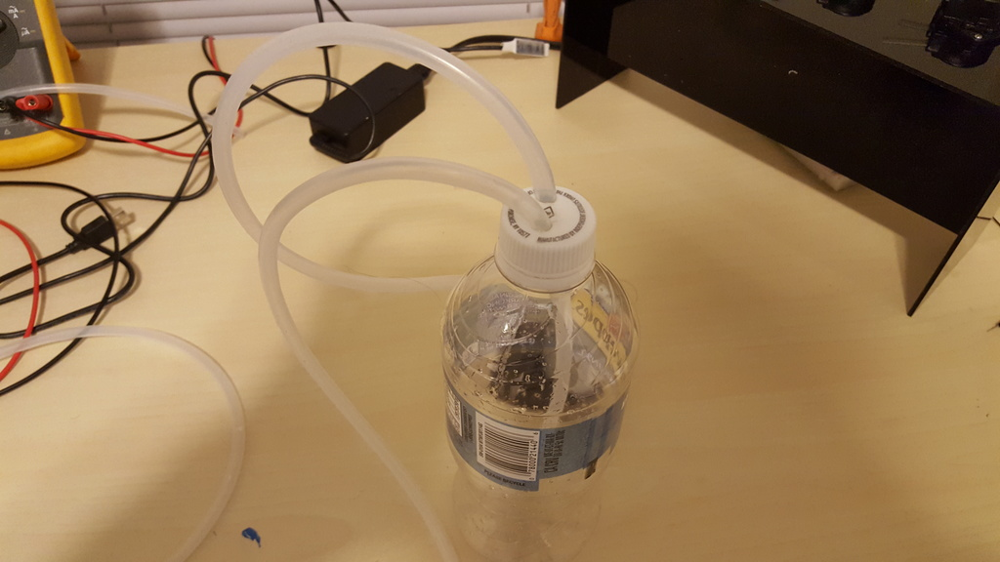
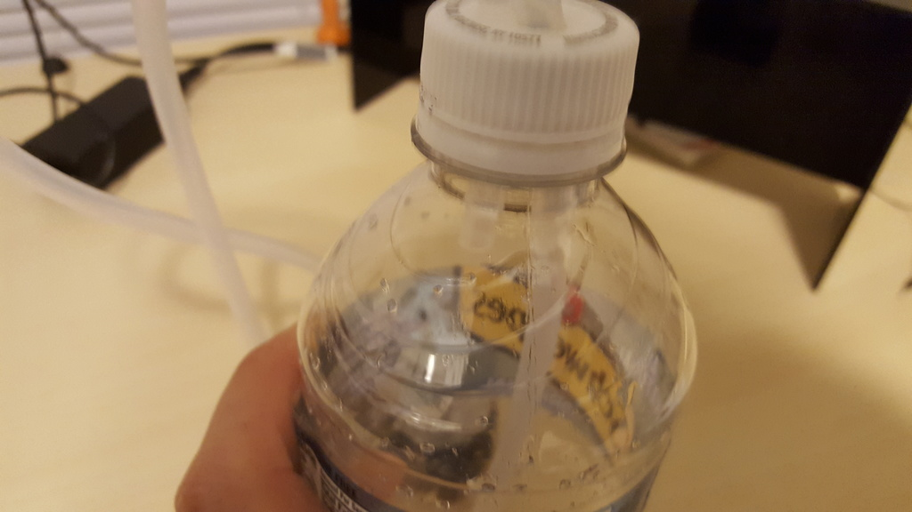

# Experimenting with Air Pump Hardware

Order from 2016-12-17 came in.

## Construction

1. Took a seltzer bottle cap and drilled two 1/4" holes in it.

   

   
   

2. Cut the 3/16" ID, 1/4" OD tubing into two pieces. The lengths will depend on your setup. One piece will feed from the cap to the motor and the other from the bottom of the container (through the cap) to the cup that the drink is being mixed into.
  

  
  

  - Note: the tubing is flimsy with 1/32" wall, but fits perfectly and tightly enough I did not need to use the silicone sealant to create a gasket/seal. This is good since it allows me to experiment with different bottles, and also clean the tubing easier and just throw out used/old caps.
3. I made sure one piece just passed 1/2" or so through the cap and the other tube went to the bottom of the bottle, with enough room to not have the flow disrupted by the bottom of the container.

   

   
   

   

4. Hooked the end which only goes a short distance into the bottle to the air pump.
5. Done!

## Test Procedure

1. Hooked up 12V accross pump, do to the construction of the pump the polarity did not matter. the nozzle that broke off in shipment was for running the device as a vaccuum. I can still use the pump. It pumps in either direction, so polarity does not seem to matter.

2. Once I turned on power the pump ran and the air started pumping. It used a lot of current to keep the motor running (No measurements yet). There was a lot of vibration, and the motor bounced itself across my table. I am uncertain about how to mount it yet since there are no mounting flanges and my base is not sturdy enough for the vibrations. I want to try it with carboanted beverages next to make sure it will work well with them.

## Video

## Conclusion

Seems to work pretty well. I do need to measure pump
rates, but other than that it seems pretty straight
forward to me. It should work well.

## Resources

- See [the previous post](2016-12-17-hardware-pumping-seltzer.md) for the parts list.
